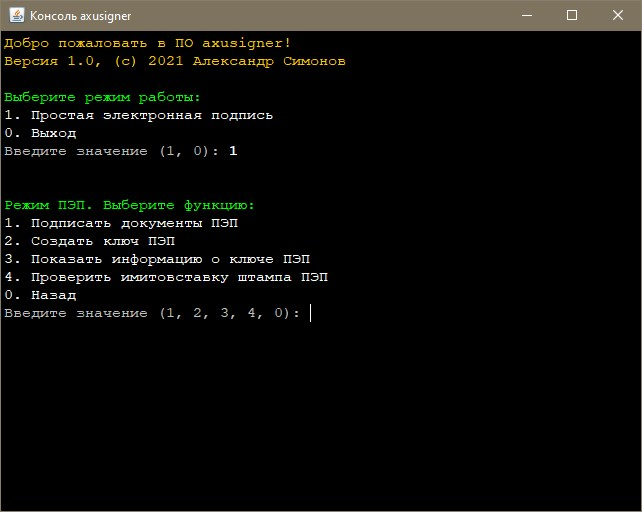
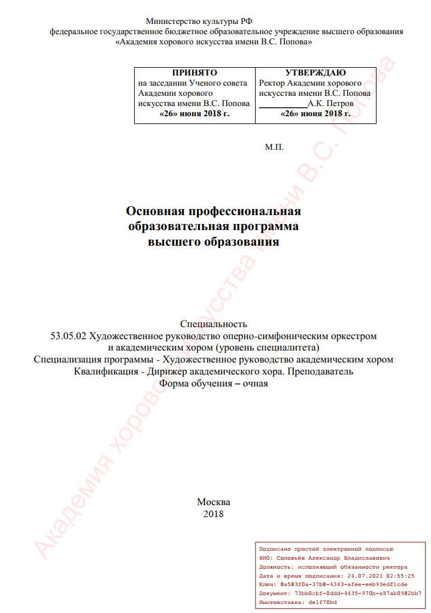

# axusigner
## Инструмент для постановки электронных подписей в документах PDF

Основное предназначение инструмента: постановка простых электронных подписей (ПЭП) в документах, публикуемых на сайте Академии хорового искусства имени В.С. Попова, в которых наличие такой подписи обусловлено положениями Приказа Рособрнадзора №831.

Инструмент разработан отделом информационных и мультимедийных технологий Академии хорового искусства имени В.С. Попова (авторы: Александр Симонов, 2021).

### Основные возможности инструмента

**Текущая версия программы позволяет проставлять на документы простую ЭП**. *В следующих версиях планируется также добавить функционал постановки усиленной ЭП по ГОСТ Р 34.10-2012/34.11-2012 с использованием сертификатов, выданных отечественными УЦ, как открепленной, так и интегрированной в PDF-документ (PAdES).*

#### Среди прочего следует также отметить:

- Кроссплатформенность (нужна лишь установленная JRE подходящей версии), независимость от наличия в системе GUI (можно работать в стандартной консоли). Простой консольный текстовый пользовательский интерфейс в стиле «вопрос-ответ».

- Удобное пакетное подписание документов: исходные файлы помещаются в директорию «in» и после подписания доступны в директории «out» в готовом подписанном виде.

- Кроме постановки штампа ЭП (на первой странице) программа также позволяет проставлять «водяные знаки» (на каждой странице) и добавлять дополнительную текстовую информацию (в область нижнего колонтитула на последней странице).

- Полностью настраиваемый внешний вид штампа, водяных знаков и области нижнего колонтитула: возможно изменять шрифты, положения, отступы, размеры, цвета, включать или отключать простановку водяных знаков и дополнительной информации в области нижнего колонтитула. Настройка производится через простой текстовый конфигурационный файл.

- Генерация и хранение ключевой информации, используемой для подписания, в зашифрованных контейнерах по ГОСТ Р 34.11-2012/ГОСТ Р 34.12-2015.

- Возможность добавления в штамп имитовставки по ГОСТ Р 34.13-2015, вычисленной на основе данных штампа, а также проверки такой имитовставки. Таким образом возможно защитить штамп от подделки указанной в нем информации, а также, при условии ведения реестра подписанных документов с указанием в нем уникального идентификатора документа, присваиваемого программой при подписании, сопоставить проверенный штамп с документом и определить таким образом легитимность его присутствия в конкретном файле.

  ***Обращаем внимание, что имитовставка на штампе сама по себе <u>не защищает документ (файл) от модификации</u>, так как это технически не предусмотрено возможностями постановки простой ЭП!** Имитовставка защищает только лишь от модификации реквизитов самого штампа, а также создания поддельного штампа злоумышленником, и должна использоваться совместно с дополнительными административными мерами!*

  

Программа свободно распространяется в виде исходных кодов под лицензией AGPLv3 и может быть собрана и использована всеми желающими на бесплатной основе (с условием соблюдения положений лицензионного соглашения).

По вопросам внедрения, использования инструмента, его поддержки и доработки на платной основе, Вы можете обращаться в отдел информационных и мультимедийных технологий Академии хорового искусства имени В.С. Попова любым удобным способом, указанном в разделе «Контакты» официального сайта Академии: http://axu.ru/contacts

Снимок окна программы, запущенной под ОС Windows:

Пример проставленной ПЭП и водяного знака в документе:

